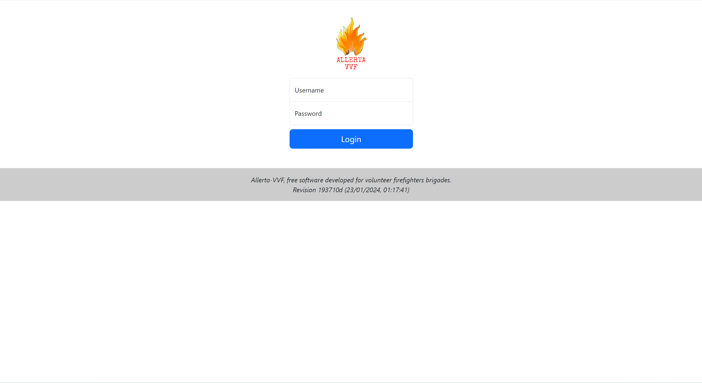
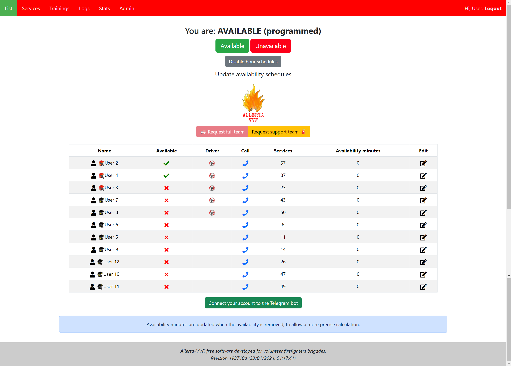

# allerta-vvf

  

**Coming soon, stay tuned!** :thumbsup:

Allerta VVF is an unofficial **open source firefighters' management software** for "Associazione VVF Volontari Darfo"

This is only a **development version**.

## Main repository
https://github.com/allerta-vvf/allerta-vvf  

## Mirrors
https://gitlab.com/allerta-vvf/allerta-vvf  
https://gitea.it/allerta-vvf/allerta-vvf  
https://gitea.matteogheza.it/allerta-vvf/allerta-vvf  
https://notabug.org/allerta-vvf/allerta-vvf  
https://gitee.com/matteogheza/allerta-vvf  

## License

## Contributors

<table>
  <tr>
    <td align="center"><a href="https://github.com/investe"> <b>InveSte</b></a> <a title="Code">💻</a> <a title="Design">🎨</a> <a title="Reviewed Pull Requests">👀</a> <a title="Security">🛡️</a> <a title="Ideas, Planning, & Feedback">🤔</a></td>
  </tr>
</table>

PS: You can see the original version of Allerta-VVF at https://github.com/investe/firefighter
